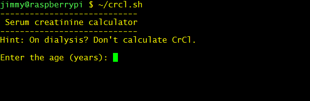
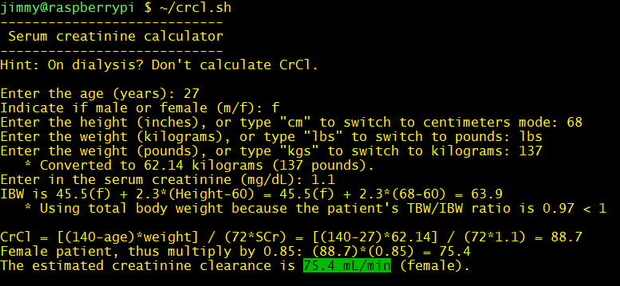
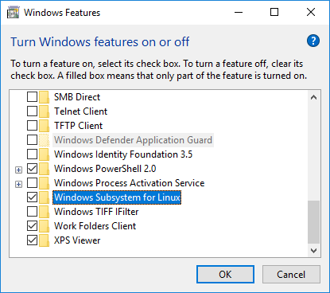
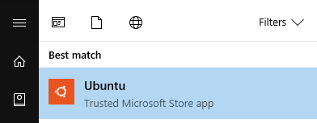
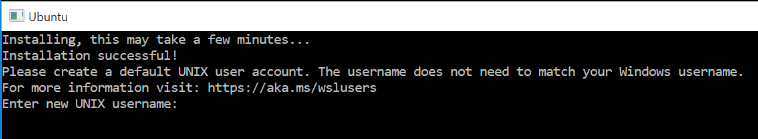
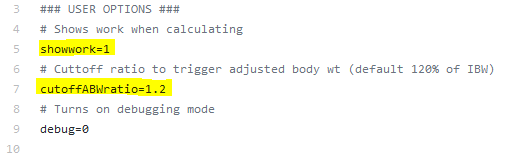

# INTRODUCTION
This is an offline creatinine clearance calculator to help those on acute care rotations. 
It automatically determines which weight to use (adjusted, ideal, total), multiplies the result
by 0.85 if female, and accounts for reduced geriatric muscle mass when serum creatinine is less than
1.0 and when the patient is older than 65 years old.

The code works for MacOS, Linux, and Windows 10 only. Windows 10 requires a separate installation of Ubuntu, whose instructions are provided below. This uses the Cockcroft-Gault Equation to estimate the renal function.



After entering in parameters:


### Important Disclaimer
This code was written to assist, not definitely determine, a person's renal clearance. In other words, it should not solely be used to estimate renal function. In a clinical setting, one **must** manually recheck these calculations.

**_Why?_** SCr is a *lagging* lab measurement reflective of the patient's state approximately 2-3 days from the present. It is imperative that one's clinical judgment must be used when determining the appropriate dosage adjustment for a patient, keeping in mind of renal function trends and current state.

The best, most-current, renal function status would be reflected by the urine output (UOP) in the labs.

See the original paper for the Cockcroft-Gault equation:
> Cockcroft DW, Gault MH. Prediction of creatinine clearance from serum creatinine. Nephron. 1976;16(1):31-41.
> doi:10.1159/000180580.


# INSTALLATION
###    Macintosh
1. `COMMAND` + `SPACE` from the desktop to open Spotlight, then type **terminal** and hit `Enter` to open terminal.

2. Copy and paste this code in terminal, and hit enter:
```
curl -L https://goo.gl/9tVe59 -o ~/Desktop/CrCl.command && chmod u+x ~/Desktop/CrCl.command
```

3. That's it! It's on your desktop now. You can move this file to your "Applications" folder or anywhere you'd like.

###    Linux
1. Fire up terminal shell with `CONTROL` + `ALT` + `T`.

2. Copy and paste this code in terminal, and hit enter:
```
curl -L https://goo.gl/9tVe59 -o ~/crcl.sh && chmod u+x ~/crcl.sh
```

3. You're all set! It's on your home directory.


###  Windows 10
Note that this is only available for Windows 10.

1. Click the *Start Menu*, and type in **Turn Windows features on or off**. Hit `Enter`.

2. Find and check the **Windows Subsystem for Linux**, and hit OK.


3. Restart your computer when prompted.

4. Click the *Start Menu*, then type **Ubuntu**. Select the "Ubuntu" app from the *Trusted Microsoft Store app* option.


5. Download it by clicking the `Get` button in the Microsoft Store. Once down, click `Launch`.

6. Follow the instructions to install. This may take a while.

- When complete, create an account. This can be the same or different as your Windows log-in. 
- Note that when entering the password, your input will not be displayed, even though you are typing. Don't worry this is normal as the system hides your input for security.

7. Then, copy and paste this command and hit enter. Enter your newly created password if prompted.
```
sudo apt-get update && sudo apt-get -y install python && curl -L https://goo.gl/9tVe59 -o ~/crcl.sh && chmod u+x ~/crcl.sh && echo 'echo Type ~/crcl.sh to start the creatinine calculator.' >> ~/.bashrc && clear; echo 'Complete! Type ~/crcl.sh to run the program. In the future, click Start Menu > Ubuntu to open the creatinine calculator.'
```

8. That's it! You're complete. Refer to the next section below on how to run the program.


## Running the program
**Mac**: To run, click the icon on your desktop. You may close the terminal window at any time to stop the program.

**Linux**: The program is installed in your home directory. Type `~/crcl.sh` to run the program.

**Windows**: *Start Menu* > Type `Ubuntu` and hit enter. In the terminal, type `~/crcl.sh` to run the program.

## Uninstalling or deleting
Simply delete the file on your desktop or home directory.


# Technical Details
The calculator uses the total body weight when less than ideal. It also uses adjusted body weight when TBW/IBW ratio is more than 1.2. 
To change this to another setting for example 1.3, you can use any text editor (Notepad, etc.) and edit the code's first section where it says `cutoffABWratio=1.2`
and changing it to `cutoffABWratio=1.3`.
 
It is also set to show its work by default, but this setting can be changed by changing `showwork=1` to `showwork=0` in the same area. I don't recommend this because forgetting how to manually calculate the renal function is never a good thing.

To change these settings, locate and change the following lines in the source code:


View the source code [here](https://github.com/jimeelicious/creatineCalculator/blob/master/crcl.sh). This program assumes Python, Bash, and cURL are installed.

#### Acknowledgements
- **Dr. Adrian Palisoc, PharmD.**
For his contribution in providing crucial clinical pearls that led to the creation of the disclaimer.
